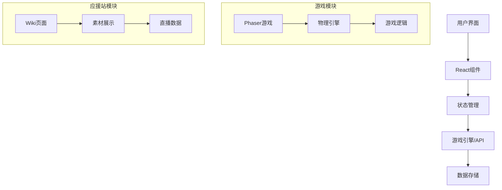

# AI开发指南

## 概述
本文档为AI助手（如Cline/Roo Code）提供开发本项目的指导，帮助AI更好地理解项目结构、编码规范和开发流程。

## 项目理解要点

### 1. 核心概念
- **岁己 (SUI)**: 虚拟主播/角色，项目的核心主题
- **应援站**: 粉丝支持网站，包含资料展示、素材管理等功能
- **小游戏**: 娱乐性游戏，目前重点是自走棋游戏

### 2. 技术栈特点
- **Next.js App Router**: 使用最新的App Router架构
- **严格TypeScript**: 禁止使用`any`类型
- **中文注释**: 所有代码注释必须使用中文
- **混合渲染**: 默认服务端组件，需要交互时使用`'use client'`

### 3. 代码组织原则
- **按功能模块组织**: 游戏、Wiki、主页等模块分离
- **组件化设计**: 可复用的React组件
- **配置与逻辑分离**: 游戏数据在config目录

## AI开发最佳实践

### 1. 代码编写规范
```typescript
// ✅ 正确示例
'use client'; // 需要交互的组件必须添加

import React, { useState } from 'react';
import { Button } from 'antd';

interface UserProps {
  name: string;
  age: number;
}

const UserComponent: React.FC<UserProps> = ({ name, age }) => {
  const [count, setCount] = useState(0);

  // 中文注释
  const handleClick = () => {
    setCount(count + 1);
  };

  return (
    <div>
      <h1>{name}</h1>
      <Button onClick={handleClick}>点击计数: {count}</Button>
    </div>
  );
};
```

### 2. 游戏开发注意事项
- **Phaser游戏**: 使用动态导入避免服务端渲染问题
- **资源管理**: 游戏资源需要正确销毁避免内存泄漏
- **物理引擎**: 使用Matter.js进行物理模拟
- **性能优化**: 注意游戏帧率和内存使用

### 3. 样式编写规范
- **Tailwind优先**: 使用Tailwind CSS类名
- **Ant Design组件**: 使用Ant Design作为UI组件库
- **自定义样式**: 在globals.css中添加全局样式
- **响应式设计**: 确保移动端兼容性

## 项目架构理解

### 1. 数据流架构


### 2. 组件层次结构
```
App Layout
├── 主页 (page.tsx)
│   ├── 导航栏
│   ├── 内容区域
│   │   ├── 主页模块 (HomeModule)
│   │   ├── 素材图库 (GalleryModule)
│   │   └── 直播记录 (RecordsModule)
│   └── 页脚
├── Wiki页面 (wiki/sui/page.tsx)
│   ├── 角色信息
│   ├── 招式展示
│   └── 历程时间线
└── 游戏页面 (game/autochess/page.tsx)
    └── Phaser游戏组件
        ├── 游戏画布
        └── UI覆盖层
```

## 开发工作流程

### 1. 新功能开发流程
1. **分析需求**: 理解功能需求和技术要求
2. **设计架构**: 确定组件结构和数据流
3. **实现代码**: 按照规范编写TypeScript代码
4. **添加样式**: 使用Tailwind和Ant Design
5. **测试验证**: 确保功能正常且无类型错误
6. **文档更新**: 更新相关文档

### 2. 游戏功能开发流程
1. **游戏设计**: 确定游戏机制和规则
2. **Phaser场景**: 创建或修改游戏场景
3. **游戏对象**: 实现单位、兵营等游戏对象
4. **系统开发**: 实现商店、经济、波次等系统
5. **UI集成**: 将游戏与React UI结合
6. **性能测试**: 测试游戏性能和内存使用

## 常见任务模板

### 1. 创建新页面
```typescript
// app/new-page/page.tsx
export default function NewPage() {
  return (
    <div className="container mx-auto p-4">
      <h1 className="text-3xl font-bold">新页面</h1>
      {/* 页面内容 */}
    </div>
  );
}
```

### 2. 创建新组件
```typescript
// components/NewComponent.tsx
'use client';

import React from 'react';

interface NewComponentProps {
  title: string;
}

export default function NewComponent({ title }: NewComponentProps) {
  return (
    <div className="p-4 border rounded-lg">
      <h2 className="text-xl font-bold">{title}</h2>
      {/* 组件内容 */}
    </div>
  );
}
```

### 3. 修改游戏配置
```typescript
// components/autoChessGame/config/NewConfig.ts
export interface NewUnit {
  id: number;
  name: string;
  health: number;
  damage: number;
}

export const NEW_UNITS: NewUnit[] = [
  { id: 1, name: '新单位', health: 100, damage: 20 },
  // ...
];
```

## 调试和问题解决

### 1. 常见问题
- **Phaser游戏不显示**: 检查动态导入和SSR设置
- **类型错误**: 确保TypeScript类型定义正确
- **样式问题**: 检查Tailwind类名和自定义CSS
- **性能问题**: 监控游戏帧率和内存使用

### 2. 调试工具
- **浏览器开发者工具**: 检查控制台和网络请求
- **TypeScript编译器**: 检查类型错误
- **React DevTools**: 检查组件状态和性能
- **Phaser调试**: 启用物理引擎调试模式

## 项目扩展建议

### 1. 短期扩展
- 完善现有游戏功能
- 添加更多应援站内容
- 优化用户体验

### 2. 长期扩展
- 添加用户系统
- 实现多人在线游戏
- 集成更多API服务
- 开发移动端应用

## 注意事项
1. **保持代码一致性**: 遵循现有代码风格
2. **中文优先**: 注释和文档使用中文
3. **性能意识**: 特别注意游戏性能
4. **可维护性**: 编写清晰、可维护的代码
5. **测试覆盖**: 重要功能添加测试
