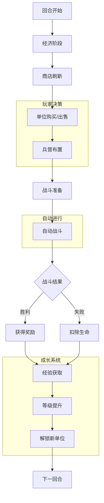

# 自走棋游戏核心循环完善方案

## 当前游戏循环分析

### 现有流程
1. **准备阶段**: 购买单位 → 放置兵营
2. **战斗阶段**: 点击"开始战斗" → 自动战斗
3. **结算阶段**: 一方基地HP归零 → 游戏结束

### 存在的问题
1. **节奏单一**: 只有购买-战斗两个阶段
2. **策略深度不足**: 缺乏经济管理、等级系统
3. **反馈循环弱**: 胜利/失败奖励不明显
4. **成长感缺失**: 没有长期进度系统

## 完善后的核心游戏循环

### 目标：创建有深度的"准备-战斗-成长"循环



## 具体改进方案

### 1. 经济系统完善

#### 当前问题：只有基础金币获取
**改进方案：引入利息系统和连胜奖励**

```typescript
// 经济管理器增强
class EnhancedEconomyManager {
  private baseGold: number = 0;
  private interestRate: number = 0.1; // 10%利息
  private maxInterestGold: number = 50; // 最多计算50金币的利息
  private winStreak: number = 0;
  private loseStreak: number = 0;

  calculateRoundGold(): number {
    let gold = 5; // 基础每回合5金币

    // 利息收入（最多5金币）
    const interest = Math.min(
      Math.floor(this.baseGold * this.interestRate),
      Math.floor(this.maxInterestGold * this.interestRate)
    );
    gold += interest;

    // 连胜奖励
    if (this.winStreak >= 3) {
      gold += Math.floor(this.winStreak / 3); // 每3连胜额外+1金币
    }

    // 连败补偿（从第3连败开始）
    if (this.loseStreak >= 3) {
      gold += 1; // 连败补偿
    }

    return gold;
  }

  updateStreak(isWin: boolean): void {
    if (isWin) {
      this.winStreak++;
      this.loseStreak = 0;
    } else {
      this.loseStreak++;
      this.winStreak = 0;
    }
  }
}
```

### 2. 等级和经验系统

#### 当前问题：没有玩家等级概念
**改进方案：引入玩家等级，解锁高级单位**

```typescript
// 等级系统
interface LevelSystem {
  currentLevel: number;
  currentExp: number;
  expToNextLevel: number;
  unlockedShopTiers: number[]; // 解锁的商店等级
}

class PlayerLevelSystem {
  private level: number = 1;
  private exp: number = 0;
  private readonly expTable: number[] = [0, 2, 6, 12, 20, 30, 42, 56, 72, 90]; // 1-10级所需经验

  addExp(amount: number, isWin: boolean): void {
    // 胜利获得更多经验
    const multiplier = isWin ? 1.5 : 1.0;
    this.exp += Math.floor(amount * multiplier);

    // 检查升级
    this.checkLevelUp();
  }

  private checkLevelUp(): void {
    while (this.level < this.expTable.length && this.exp >= this.expTable[this.level]) {
      this.level++;
      this.onLevelUp();
    }
  }

  private onLevelUp(): void {
    // 升级效果
    console.log(`🎉 升级到 ${this.level} 级！`);

    // 解锁新的商店等级概率
    if (this.level >= 3) {
      // 解锁2级单位
    }
    if (this.level >= 5) {
      // 解锁3级单位
    }
    if (this.level >= 7) {
      // 解锁4级单位
    }
    if (this.level >= 9) {
      // 解锁5级单位
    }
  }

  getShopProbabilities(): number[] {
    // 根据等级返回商店概率
    const probabilities = {
      1: [100, 0, 0, 0, 0],
      2: [70, 30, 0, 0, 0],
      3: [50, 35, 15, 0, 0],
      4: [30, 40, 25, 5, 0],
      5: [15, 30, 35, 18, 2],
      6: [10, 25, 35, 25, 5],
      7: [5, 20, 35, 30, 10],
      8: [0, 15, 30, 35, 20],
      9: [0, 10, 25, 35, 30],
      10: [0, 5, 20, 35, 40]
    };

    return probabilities[Math.min(this.level, 10) as keyof typeof probabilities];
  }
}
```

### 3. 单位合成系统

#### 当前问题：单位不能升级
**改进方案：3个相同单位合成1个高级单位**

```typescript
// 单位合成系统
class UnitMergeSystem {
  private barracks: Barracks[] = [];

  checkForMerge(): void {
    // 按单位类型分组
    const unitGroups = new Map<string, Barracks[]>();

    this.barracks.forEach(barrack => {
      const unitKey = barrack.unitKey;
      if (!unitGroups.has(unitKey)) {
        unitGroups.set(unitKey, []);
      }
      unitGroups.get(unitKey)!.push(barrack);
    });

    // 检查每组是否有3个相同单位
    unitGroups.forEach((barracksList, unitKey) => {
      if (barracksList.length >= 3) {
        this.mergeUnits(barracksList.slice(0, 3), unitKey);
      }
    });
  }

  private mergeUnits(barracksToMerge: Barracks[], unitKey: string): void {
    // 获取单位数据
    const unitData = UNIT_TYPES[unitKey];
    if (!unitData) return;

    // 计算新位置（取三个单位的平均位置）
    const avgX = barracksToMerge.reduce((sum, b) => sum + b.x, 0) / 3;
    const avgY = barracksToMerge.reduce((sum, b) => sum + b.y, 0) / 3;

    // 销毁原来的三个单位
    barracksToMerge.forEach(barrack => {
      const index = this.barracks.indexOf(barrack);
      if (index > -1) {
        this.barracks.splice(index, 1);
      }
      barrack.destroy();
    });

    // 创建新的2星单位
    const mergedUnitKey = `${unitKey}_star2`;
    const mergedData = {
      ...unitData,
      name: `${unitData.name} ★`,
      hp: unitData.hp * 1.8, // 2星单位属性提升
      damage: unitData.damage * 1.8,
      tier: unitData.tier, // 保持相同等级
      isStar2: true
    };

    const mergedBarrack = new Barracks(this.scene, avgX, avgY, mergedUnitKey, mergedData);
    this.barracks.push(mergedBarrack);

    // 播放合成特效
    this.playMergeEffect(avgX, avgY);

    console.log(`✨ 合成成功：${unitData.name} → ${mergedData.name}`);
  }

  private playMergeEffect(x: number, y: number): void {
    // 合成特效动画
    const effect = this.scene.add.circle(x, y, 10, 0xffff00);
    effect.setDepth(100);

    this.scene.tweens.add({
      targets: effect,
      scale: 3,
      alpha: 0,
      duration: 500,
      onComplete: () => effect.destroy()
    });
  }
}
```

### 4. 波次系统增强

#### 当前问题：波次简单，缺乏变化
**改进方案：引入波次类型和特殊事件**

```typescript
// 增强的波次管理器
class EnhancedWaveManager {
  private currentWave: number = 0;
  private waveTypes: WaveType[] = ['normal', 'elite', 'boss', 'event'];

  getNextWave(): WaveConfig {
    this.currentWave++;

    // 每5波一个精英波，每10波一个BOSS波
    let waveType: WaveType = 'normal';
    if (this.currentWave % 10 === 0) {
      waveType = 'boss';
    } else if (this.currentWave % 5 === 0) {
      waveType = 'elite';
    } else if (Math.random() < 0.1) { // 10%几率事件波
      waveType = 'event';
    }

    return this.generateWaveConfig(waveType, this.currentWave);
  }

  private generateWaveConfig(type: WaveType, waveNumber: number): WaveConfig {
    const baseConfig = {
      waveNumber,
      enemyCount: 5 + Math.floor(waveNumber * 1.5),
      enemyLevel: 1 + Math.floor(waveNumber / 3),
      goldReward: 1 + Math.floor(waveNumber / 2),
      expReward: 1
    };

    switch (type) {
      case 'elite':
        return {
          ...baseConfig,
          enemyCount: Math.floor(baseConfig.enemyCount * 0.7),
          enemyLevel: baseConfig.enemyLevel + 1,
          goldReward: baseConfig.goldReward * 2,
          expReward: baseConfig.expReward * 2,
          description: '精英波次 - 敌人更强，奖励更高'
        };

      case 'boss':
        return {
          ...baseConfig,
          enemyCount: 1, // BOSS只有一个
          enemyLevel: baseConfig.enemyLevel + 3,
          goldReward: baseConfig.goldReward * 5,
          expReward: baseConfig.expReward * 5,
          hasBoss: true,
          description: 'BOSS战 - 击败强大BOSS获得丰厚奖励'
        };

      case 'event':
        const events: EventType[] = ['double_gold', 'unit_discount', 'free_reroll', 'extra_exp'];
        const event = events[Math.floor(Math.random() * events.length)];

        return {
          ...baseConfig,
          event,
          description: this.getEventDescription(event)
        };

      default:
        return baseConfig;
    }
  }

  private getEventDescription(event: EventType): string {
    const descriptions = {
      double_gold: '黄金事件：本回合获得双倍金币！',
      unit_discount: '折扣事件：所有单位价格减半！',
      free_reroll: '刷新事件：免费刷新商店一次！',
      extra_exp: '经验事件：获得额外经验值！'
    };
    return descriptions[event];
  }
}
```

### 5. 游戏进度和奖励系统

#### 当前问题：缺乏长期目标
**改进方案：引入成就和每日任务**

```typescript
// 成就系统
interface Achievement {
  id: string;
  name: string;
  description: string;
  condition: (gameState: GameState) => boolean;
  reward: number; // 金币奖励
  unlocked: boolean;
}

const ACHIEVEMENTS: Achievement[] = [
  {
    id: 'first_win',
    name: '首胜',
    description: '赢得第一场战斗',
    condition: (state) => state.totalWins >= 1,
    reward: 100,
    unlocked: false
  },
  {
    id: 'merge_master',
    name: '合成大师',
    description: '合成一个3星单位',
    condition: (state) => state.merged3StarUnits >= 1,
    reward: 200,
    unlocked: false
  },
  {
    id: 'rich_player',
    name: '大富翁',
    description: '单回合拥有50金币',
    condition: (state) => state.maxGoldInRound >= 50,
    reward: 150,
    unlocked: false
  },
  {
    id: 'wave_10',
    name: '生存专家',
    description: '达到第10波',
    condition: (state) => state.maxWave >= 10,
    reward: 300,
    unlocked: false
  }
];

// 每日任务
interface DailyQuest {
  id: string;
  name: string;
  description: string;
  progress: number;
  target: number;
  reward: number;
  completed: boolean;
}

const DAILY_QUESTS: DailyQuest[] = [
  {
    id: 'play_3_games',
    name: '日常参与',
    description: '进行3场游戏',
    progress: 0,
    target: 3,
    reward: 50,
    completed: false
  },
  {
    id: 'win_1_game',
    name: '胜利之星',
    description: '赢得1场游戏',
    progress: 0,
    target: 1,
    reward: 100,
    completed: false
  },
  {
    id: 'merge_units',
    name: '单位合成',
    description: '合成5次单位',
    progress: 0,
    target: 5,
    reward: 75,
    completed: false
  }
];
```

## 实施优先级

### 第一阶段：核心循环基础（1周）
1. **经济系统完善** - 利息和连胜奖励
2. **等级系统** - 基础经验获取和升级
3. **单位合成** - 3合1升级系统

### 第二阶段：游戏深度增强（2周）
1. **波次系统增强** - 精英波、BOSS波
2. **商店概率调整** - 基于等级的商店刷新
3. **成就系统** - 基础成就和奖励

### 第三阶段：长期留存功能（3周）
1. **每日任务系统**
2. **进度保存** - 本地存储游戏进度
3. **数据统计** - 游戏数据记录和分析

## 预期效果

### 游戏体验提升
1. **策略深度**: 经济管理、单位合成、等级规划
2. **成长感**: 明确的进度系统和奖励反馈
3. **重玩价值**: 多种波次类型和随机事件
4. **长期目标**: 成就系统和每日任务

### 技术指标
- **单局时长**: 10-20分钟（适中）
- **学习曲线**: 渐进式，新手友好
- **平衡性**: 通过数据调整保持平衡
- **性能**: 保持60FPS，优化内存使用

## 风险评估

### 技术风险
- **复杂度增加**: 分阶段实施，确保每阶段稳定
- **平衡性挑战**: 建立数据驱动平衡调整机制
- **性能影响**: 优化算法，避免复杂计算每帧进行

### 设计风险
- **过度复杂**: 保持核心简单，可选功能逐步添加
- **学习成本**: 提供清晰的新手引导
- **玩家流失**: 通过奖励和进度系统保持参与度

## 下一步行动

1. **立即开始**: 实现经济系统改进（利息+连胜）
2. **并行开发**: 单位合成系统 + 等级系统
3. **测试验证**: 每完成一个功能进行平衡测试
4. **迭代优化**: 根据玩家反馈调整数值和机制

通过这个核心循环完善方案，自走棋游戏将从简单的原型进化为一个有深度、有策略、有成长感的完整游戏体验。
