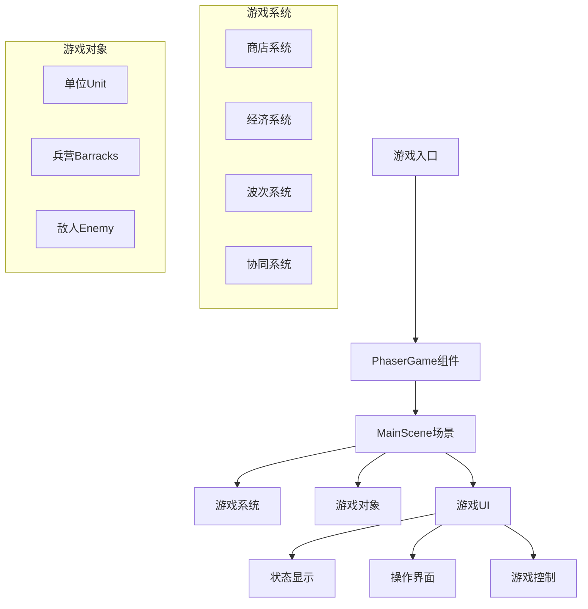
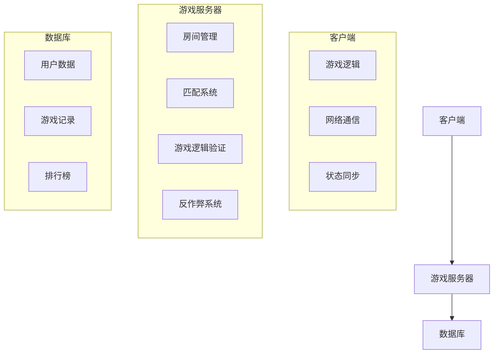

# 自走棋游戏后续开发规划

## 当前状态分析

### 已完成功能
1. ✅ Phaser游戏基础框架
2. ✅ 游戏场景和物理引擎集成
3. ✅ 基础单位系统（Unit类）
4. ✅ 兵营系统（Barracks类）
5. ✅ 商店系统（ShopSystem）
6. ✅ 波次管理系统（WaveManager）
7. ✅ 经济管理系统（EconomyManager）
8. ✅ 协同系统（SynergySystem）
9. ✅ 游戏UI界面

### 待完善功能
1. 🔄 游戏平衡性调整
2. 🔄 更多单位类型和技能
3. 🔄 完整的游戏流程
4. 🔄 多人游戏支持
5. 🔄 游戏数据持久化
6. 🔄 性能优化

## 游戏架构分析

### 当前架构


## 后续开发规划

### 第一阶段：核心游戏完善（1-2周）

#### 1.1 单位系统增强
```typescript
// 扩展单位类型系统
enum UnitType {
  Warrior = 'warrior',      // 战士
  Archer = 'archer',        // 弓箭手
  Mage = 'mage',            // 法师
  Tank = 'tank',            // 坦克
  Support = 'support',      // 辅助
  Assassin = 'assassin',    // 刺客
}

// 技能系统设计
interface Skill {
  id: string;
  name: string;
  description: string;
  cooldown: number;
  manaCost: number;
  effect: (caster: Unit, target: Unit) => void;
}

// 单位等级系统
interface UnitLevel {
  level: number;
  health: number;
  damage: number;
  attackSpeed: number;
  unlockSkills: Skill[];
}
```

**具体任务：**
- 添加10+种不同单位类型
- 实现单位升级系统（1-3星）
- 添加单位技能系统
- 实现单位合成系统（3个1星合成1个2星）

#### 1.2 游戏平衡性调整
- **数值平衡**: 调整单位属性、价格、伤害
- **经济系统**: 优化金币获取和消费
- **波次难度**: 调整敌人波次难度曲线
- **协同效果**: 平衡不同协同的效果强度

### 第二阶段：游戏功能扩展（2-3周）

#### 2.1 游戏模式扩展
```typescript
// 游戏模式枚举
enum GameMode {
  Campaign = 'campaign',      // 战役模式
  Endless = 'endless',        // 无尽模式
  PvP = 'pvp',                // 玩家对战
  Challenge = 'challenge',    // 挑战模式
}

// 游戏难度设置
interface Difficulty {
  name: string;
  enemyHealthMultiplier: number;
  enemyDamageMultiplier: number;
  goldRewardMultiplier: number;
  waveInterval: number;
}
```

**具体任务：**
- 添加战役模式（关卡制）
- 实现无尽模式（无限波次）
- 添加挑战模式（特殊规则）
- 实现难度选择系统

#### 2.2 游戏内容扩展
- **地图系统**: 多种战场地图
- **天气系统**: 影响战斗的天气效果
- **道具系统**: 可购买的战斗道具
- **成就系统**: 游戏成就和奖励

### 第三阶段：多人游戏支持（3-4周）

#### 3.1 多人游戏架构


**具体任务：**
- **实时对战**: 1v1、2v2对战模式
- **观战系统**: 观看其他玩家对战
- **排行榜**: 全球/好友排行榜
- **好友系统**: 添加好友、邀请对战

#### 3.2 网络同步方案
```typescript
// 网络消息类型
enum NetworkMessage {
  PlayerJoin = 'player_join',
  PlayerLeave = 'player_leave',
  UnitPurchase = 'unit_purchase',
  UnitPlace = 'unit_place',
  BattleStart = 'battle_start',
  BattleResult = 'battle_result',
}

// 游戏状态同步
interface GameState {
  players: PlayerState[];
  round: number;
  phase: GamePhase;
  timeRemaining: number;
}

interface PlayerState {
  playerId: string;
  gold: number;
  health: number;
  units: UnitState[];
  barracks: BarrackState[];
}
```

### 第四阶段：高级功能开发（持续）

#### 4.1 AI对手系统
- **智能AI**: 具有策略的AI对手
- **难度分级**: 简单、普通、困难、专家
- **学习系统**: AI从玩家行为学习
- **挑战模式**: 特殊AI挑战关卡

#### 4.2 社交功能
- **公会系统**: 创建/加入公会
- **公会战**: 公会之间的对战
- **聊天系统**: 游戏内实时聊天
- **表情系统**: 战斗表情和特效

#### 4.3 商业化功能
- **皮肤系统**: 单位皮肤、战场皮肤
- **赛季系统**: 定期更新和奖励
- **战斗通行证**: 付费奖励系统
- **内购商店**: 虚拟物品购买

## 技术实现细节

### 1. 性能优化策略

#### 1.1 渲染优化
```typescript
// 对象池管理
class ObjectPool<T> {
  private pool: T[] = [];
  private createFn: () => T;

  constructor(createFn: () => T) {
    this.createFn = createFn;
  }

  get(): T {
    return this.pool.pop() || this.createFn();
  }

  release(obj: T): void {
    this.pool.push(obj);
  }
}

// 单位对象池
const unitPool = new ObjectPool(() => new Unit());
```

#### 1.2 内存管理
- **资源卸载**: 及时销毁不再使用的资源
- **纹理管理**: 共享纹理，减少内存占用
- **垃圾回收**: 手动触发GC优化时机
- **性能监控**: 实时监控帧率和内存使用

### 2. 数据持久化

#### 2.1 本地存储
```typescript
// 游戏数据存储
interface GameSaveData {
  playerId: string;
  unlockedUnits: string[];
  playerLevel: number;
  experience: number;
  gold: number;
  achievements: string[];
  settings: GameSettings;
}

// 存储管理
class SaveManager {
  static saveGame(data: GameSaveData): void {
    localStorage.setItem('autochess_save', JSON.stringify(data));
  }

  static loadGame(): GameSaveData | null {
    const data = localStorage.getItem('autochess_save');
    return data ? JSON.parse(data) : null;
  }

  static clearSave(): void {
    localStorage.removeItem('autochess_save');
  }
}
```

#### 2.2 云存储
- **用户账户**: 绑定社交账号
- **跨设备同步**: 多设备游戏进度同步
- **数据备份**: 自动备份游戏数据
- **恢复功能**: 数据丢失恢复机制

### 3. 游戏平衡性设计

#### 3.1 数值公式
```typescript
// 伤害计算公式
function calculateDamage(attacker: Unit, defender: Unit): number {
  const baseDamage = attacker.damage;
  const armorReduction = defender.armor / (defender.armor + 100);
  const finalDamage = baseDamage * (1 - armorReduction);

  // 暴击计算
  const isCritical = Math.random() < attacker.criticalChance;
  if (isCritical) {
    return finalDamage * attacker.criticalMultiplier;
  }

  return finalDamage;
}

// 经验值计算公式
function calculateExperience(level: number): number {
  return 100 * Math.pow(1.5, level - 1);
}
```

#### 3.2 平衡性测试
- **自动化测试**: 模拟对战测试平衡性
- **数据收集**: 收集玩家游戏数据
- **A/B测试**: 不同版本平衡性对比
- **社区反馈**: 收集玩家反馈调整平衡

## 开发路线图

### 里程碑1：基础完善（2周）
- [ ] 单位系统扩展（10+单位类型）
- [ ] 技能系统实现
- [ ] 游戏平衡性调整
- [ ] 基础UI优化

### 里程碑2：内容扩展（3周）
- [ ] 多种游戏模式
- [ ] 地图和天气系统
- [ ] 成就和任务系统
- [ ] 新手引导完善

### 里程碑3：多人游戏（4周）
- [ ] 实时对战系统
- [ ] 匹配和房间系统
- [ ] 排行榜和社交功能
- [ ] 网络同步优化

### 里程碑4：高级功能（持续）
- [ ] AI对手系统
- [ ] 公会和社区功能
- [ ] 商业化功能
- [ ] 跨平台支持

## 技术挑战与解决方案

### 1. 网络同步挑战
**挑战**: 实时对战中的状态同步
**解决方案**:
- 使用确定性锁步算法
- 状态压缩和差值同步
- 预测和 reconciliation

### 2. 性能优化挑战
**挑战**: 大量单位同时战斗的性能问题
**解决方案**:
- 对象池和批量渲染
- LOD（细节层次）系统
- 后台线程计算

### 3. 跨平台挑战
**挑战**: 不同设备性能差异
**解决方案**:
- 自适应画质设置
- 触摸和键盘双控制
- 响应式UI设计

## 成功指标

### 1. 游戏性指标
- **玩家留存率**: 次日留存 > 40%，7日留存 > 20%
- **游戏时长**: 平均单次游戏时长 > 15分钟
- **完成率**: 战役模式完成率 > 30%
- **满意度**: 玩家评分 > 4.5/5

### 2. 技术指标
- **性能**: 稳定60FPS，内存使用 < 500MB
- **加载时间**: 首次加载 < 5秒，场景切换 < 2秒
- **网络延迟**: 对战延迟 < 100ms
- **崩溃率**: 崩溃率 < 0.1%

### 3. 运营指标
- **活跃用户**: DAU > 1000，MAU > 10000
- **收入**: 月收入 > $1000（商业化后）
- **社区规模**: 社区成员 > 5000
- **内容更新**: 每月至少1次大更新

## 风险评估与应对

### 1. 技术风险
- **性能问题**: 提前进行性能测试和优化
- **网络问题**: 实现断线重连和状态恢复
- **安全问题**: 加强反作弊和数据安全

### 2. 内容风险
- **平衡性问题**: 建立快速平衡调整机制
- **内容枯竭**: 规划长期内容更新路线
- **版权问题**: 确保所有素材合法使用

### 3. 市场风险
- **竞争激烈**: 突出游戏特色和创新点
- **用户获取**: 制定有效的推广策略
- ** monetization**: 平衡免费和付费内容

通过系统化的规划和实施，自走棋游戏将成为一个功能完善、体验优秀、具有长期生命力的游戏产品。
