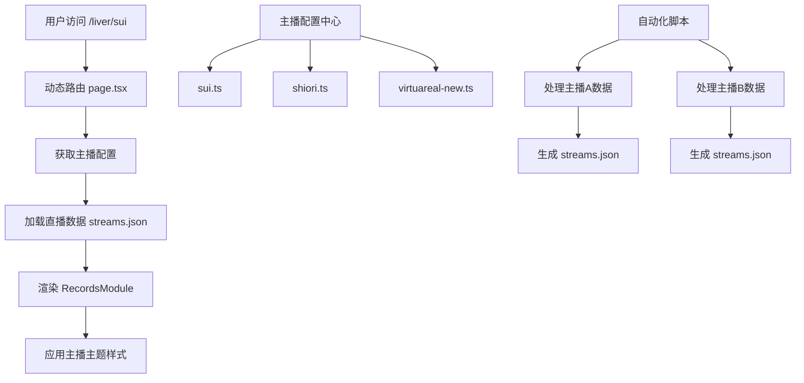

# 多主播系统实施计划

## 项目概述
扩展现有直播记录功能到其他主播的个人主页，创建新路由 `/liver/xxx`，其中 `xxx` 是主播简称。为 VirtuaReal 新出的四个成员创建通用主页系统。

## 核心需求
1. 创建动态路由 `/liver/[liverId]` 支持多主播
2. 每个主播有独立的背景风格和直播记录模块
3. 每个主播有各自的直播记录文件夹
4. 支持 VirtuaReal 新出的四个成员
5. 保持现有自动化数据更新机制

## 系统架构设计

### 文件结构
```
src/
├── app/
│   ├── liver/
│   │   ├── [liverId]/
│   │   │   ├── page.tsx          # 动态路由页面
│   │   │   ├── loading.tsx       # 加载状态
│   │   │   └── not-found.tsx     # 404页面
│   │   └── page.tsx              # 主播列表页面
│   └── page.tsx                  # 现有主页（岁己SUI）
├── components/
│   ├── Home/                     # 现有组件（需要重构）
│   └── Liver/                    # 新组件（可选）
├── data/
│   └── livers/                   # 主播数据配置
│       ├── index.ts             # 配置导出
│       ├── types.ts             # 类型定义
│       ├── sui.ts              # 岁己SUI配置
│       ├── shiori.ts           # 栞栞配置
│       └── virtuareal-new.ts   # VirtuaReal新成员配置
└── types/
    └── liver.ts                 # 类型定义

public/data/streams/
├── sui/                        # 岁己SUI数据
│   ├── streams.json
│   └── [stream folders]
├── shiori/                     # 栞栞数据
│   ├── streams.json
│   └── [stream folders]
└── vr-new-1/                   # VirtuaReal新成员1数据
    ├── streams.json
    └── [stream folders]
```

### 数据流


## 实施步骤

### 阶段一：基础架构搭建
1. 创建主播数据配置系统 (`src/data/livers/`)
2. 实现动态路由框架 (`src/app/liver/[liverId]/`)
3. 创建类型定义和接口

### 阶段二：组件重构
1. 重构 `RecordsModule.tsx` 支持多主播参数
2. 扩展 `RecordsShared.tsx` 类型定义
3. 迁移 `SuiData.ts` 到新的配置系统
4. 创建主题系统支持主播个性化样式

### 阶段三：数据系统更新
1. 重构自动化脚本 `sync_streams.mjs` 支持多主播
2. 创建主播配置文件 (`scripts/liver-config.mjs`)
3. 更新数据加载逻辑支持主播隔离
4. 创建测试数据验证功能

### 阶段四：测试和部署
1. 创建测试页面和验证功能
2. 编写文档和使用指南
3. 部署验证和性能测试
4. 创建维护和更新流程

## 技术细节

### 主播配置接口
```typescript
interface LiverInfo {
  id: string;                    // 唯一标识符，如 "sui", "shiori"
  name: string;                  // 全名
  shortName: string;            // 简称
  group: string;                // 所属团体
  colorMain: string;           // 主色调
  colorSub: string;            // 副色调
  dataPath: string;            // 数据路径
  bilibiliUid?: string;        // B站UID
  description: string;          // 描述
  tags: string[];              // 标签
  // 个性化字段
}
```

### 动态路由页面结构
```typescript
// src/app/liver/[liverId]/page.tsx
export default async function LiverPage({ params }: { params: { liverId: string } }) {
  const { liverId } = params;
  const liverConfig = getLiverConfig(liverId);

  if (!liverConfig) {
    notFound();
  }

  // 加载主播数据
  const streams = await fetchStreams(liverConfig.dataPath);

  return (
    <LiverPageLayout config={liverConfig}>
      <RecordsModule
        streams={streams}
        liverConfig={liverConfig}
      />
    </LiverPageLayout>
  );
}
```

### 自动化脚本更新
- 支持命令行参数：`--liver [id]`, `--all`, `--incremental`, `--full`
- 配置驱动数据源和目标路径
- 保持向后兼容性

## 向后兼容性
1. 现有主页 (`/`) 继续作为岁己SUI的默认页面
2. 现有数据路径保持兼容
3. 现有组件功能保持不变
4. 逐步迁移，不影响现有用户

## 测试计划
1. 路由测试：验证动态路由参数解析
2. 数据加载测试：验证主播配置和数据加载
3. 组件兼容性测试：验证现有组件在多主播场景
4. 样式主题测试：验证主播主题应用
5. 错误处理测试：验证404和错误页面

## 部署指南
1. 环境要求：Node.js 18+, Next.js 14+
2. 配置主播数据源路径
3. 运行初始数据同步
4. 构建和部署生产版本
5. 设置定期数据更新任务

## 维护和扩展
1. 添加新主播：创建配置文件 + 运行数据同步
2. 日常更新：增量同步脚本
3. 性能优化：数据分页、图片懒加载
4. 功能扩展：统计面板、跨主播对比

## 时间估算
- 基础架构：2-3天
- 组件重构：2-3天
- 数据系统：2-3天
- 测试部署：1-2天
- 总计：7-11个工作日

## 风险与缓解
1. **数据迁移风险**：保持向后兼容，分阶段迁移
2. **性能影响**：实施懒加载和缓存策略
3. **配置复杂性**：提供详细文档和示例
4. **维护负担**：自动化脚本和清晰文档

## 成功标准
1. 所有主播页面可正常访问
2. 直播记录功能正常工作
3. 主题样式正确应用
4. 自动化脚本支持多主播
5. 文档完整且易于理解

---
*计划创建时间：2026-01-14*
*创建者：Roo (Architect Mode)*
