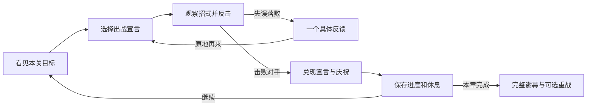

# 《岁岁过招》游戏策划 v0.1

初稿日期：2026-09-06；更新：2026-09-07。P0 已推送，P1 三 Boss 首章及体力、硬直、破架、反击已实现并通过技术验收。本文保留最初策划假设，当前实现以 [P1 说明](D:/workspace/myrepo/my-pixijs-game/docs/sui-sparring-p1.md) 为准。依据：[岁己 SUI 近期游戏偏好调研](D:/workspace/myrepo/my-pixijs-game/plans/sui-game-research-2026-09-06.md)，下文 E01 等编号对应其中证据。

## 1. 一句话提案

**一款能在浏览器窗口里玩的单屏 2D Boss 挑战游戏：小岁先说“这把一定过”，玩家看懂招式、抓住反击，让台下的饼干观众见证从差一点到真的过了。**

原工作名《这把一定过》，P0 暂定名《岁岁过招 · 竹庭篇》。入口 `/game/one-more` 已接入本站 `/demos` 游戏列表，名称仍可调整。

作品的个性来自“自选出战宣言 + 看得懂的进步 + 兑现时刻”。每场挑战都是一个很短的故事：先说到什么程度，过程是否撑住，最后做没做到。游戏独立提供这些情境，直播观众可以围绕它说话。

优先满足三个体验：**我知道要做什么；我感觉自己学会了；我想把刚才这一幕给别人看。**

## 2. 面向谁，提供什么

| 对象 | 首要体验 | 对应设计 | 必须验证的事情 |
| --- | --- | --- | --- |
| 岁己 | 有目标、有掌握感，也能接弹幕和停下 | 清楚的 Boss 招式；随时暂停；战间不限时；原地重试 | 从只狼/法环迁移到 2D 后是否仍感到有趣 |
| 饼干岁 | 陪她认真挑战，也能会心吐槽 | 岁己角色表情、少量可核对的语气、宣言兑现、共同胜利 | 粉丝是否愿意亲自玩，而非只看她玩 |
| 其他虚拟主播及观众 | 不用补背景就能理解一段节目 | 规则和承诺在画面上成立；角色不挡战场；可自定义显示名 | 主播能否自然说话，观众能否理解转折 |
| 一般玩家 | 无须认识岁己也能享受操作与挑战 | 原创场景、清楚反馈、难度辅助、短篇结局和重战 | 非粉丝是否主动重试、是否认为美术与角色有吸引力 |

四类价值是待测假设，不能用粉丝的好评代替一般玩家的接受度。首版免费、免登录，通过本站 game 入口直接进入可玩场景。

## 3. 世界与画面

故事发生在一座准备收场演出的道场。小岁要通过三场试炼，敲响收场钟。对手各有架势和脾气，战前两句对白就能交代“谁在挡路、为什么要过这一关”。一般玩家可以把她理解为第一次站上试炼台的主角。

每场胜利让道场发生一个可见变化：侧门打开、看台亮起、最后敲钟。章节结尾有完整谢幕，不依靠了解主播历史才能看懂。

美术采用有真实材质依据的清爽绘本风：可辨认的木、石、金属、布料，角色动作适度夸张。浅冷灰场地配朱红护具、青绿旗帜和中性深灰轮廓；木色用于局部道具。背景低细节，对手、武器和落点有清楚反差。这是结合制作预算的选择，是否合她口味仍需原型验证，不能把它说成已被 E04 证实。

角色有完整站姿、移动、攻击、防御、受击、胜利动作。自走棋现有圆形头像不适合作为这款动作游戏的战斗角色。保留可爱表情，但避免让表情遮住身体动作。

## 4. 核心循环与时长

时间预算是产品目标，需测试调整：

- 首次 30 秒内能移动、出手并看到对手回应，2 分钟内经历一次可以理解的防御或反击成功。
- 一次完整 Boss 尝试约 45–90 秒。对手动作组合之间有短空隙，战间允许任意长时间聊天。
- 失败后一个确认动作即可重试，决定再来后约 2 秒恢复操作，不需要跑图捡资源。
- 单 Boss 原型足以支持 5–10 分钟试玩；三 Boss 首章初次完成目标 20–40 分钟，含教学和重试。
- 通关后的三 Boss 重战目标 8–12 分钟，包含简短战前选择；熟练玩家可能更快。
- 主播可以把首章作为约 30–60 分钟的节目，实际长度由聊天和挑战次数决定，不设置强制直播计时。

第一轮只检验单 Boss 循环。三 Boss 重战、修饰项和分享属于后续完整首章范围。

## 5. 战斗规则

### 操作与基本取舍

单屏横向场地，角色自动朝向对手，不要求瞄准，不设跳跃、悬崖或镜头操作。基础输入：左右移动、攻击、格挡、闪避、暂停。

键盘默认候选为 `A/D` 移动、`J` 攻击、`K` 格挡、`Space` 闪避、`Esc` 暂停；允许重绑。玩家用关卡中的低风险交手学习，设置面板承担键位配置。战斗中主要依靠姿态、落点和短状态反馈表达规则。

| 动作 | 基础收益 | 学习后的收益 | 代价和限制 |
| --- | --- | --- | --- |
| 攻击 | 命中削减对手气势；可按住进行基础连打 | 在收招空隙出手效率更高 | 挥空和连续贪刀会错过防御时机 |
| 持续格挡 | 能挡普通招式，不掉生命，但会被推退并短暂硬直 | 帮助第一次看懂连击节奏 | 不能一直挡住明显的压制重击 |
| 精准格挡 | 在攻击到达前短时间内重新按下格挡 | 明显削减对手气势，给出清脆反馈和短反击机会 | 长按不自动连续精准格挡；窗口为调参项 |
| 闪避 | 移出落点并获得短保护 | 绕过压制重击、选择反击位置 | 有恢复时间，连续乱按不能全程无敌 |

玩家初始 5 格生命；Boss 只有一条分段气势槽。普通攻击小幅削减气势，精准格挡和抓空隙反击削减更多。气势清空后触发明确的制胜动作和结算，避免初版堆叠生命、架势、耐力、法力等多条数值。

普通招式由动作与武器轨迹预告，压制重击同时用举武器姿态和地面形状表达，颜色、音效仅作补充。不要让不认识某个颜色的玩家无法判断。

精准格挡的初始试调窗口约为命中前 160 ms，基础闪避保护约 220 ms，普通招首次展示的预告约 700–1,000 ms。它们是需要实机调校的起点；应优先保证动画接触点与判定一致，不能把这些数值当已经验证的平衡。

### 招式教学和随机性

首次见到招式时，使用稳定、清楚的顺序。玩家见过三种基础招之后才改变组合。随机性用于已学招式的组合或战前内容选择，不在最后一刻随机改命中时间。

第一轮只做一个 Boss 的三个招式：

1. **试探横挥**：教“看见起手再挡”。
2. **三连敲击**：教连续节奏和收招后的反击；最后一击后留明显空隙。
3. **举势重击**：起手姿态和落点都不同，教闪避压制，不与普通横挥共用误导动画。

对手在每组动作后有明确收招。它既是攻击机会，也给主播留出说半句话的余地。更完整的看弹幕时间依靠暂停和战间休息，不要求玩家在密集连击中分心。

### 失败、进度和辅助

死亡重置当前 Boss，生命回满；保留章节进度、已见招式和个人最好表现。基础模式没有命数、死亡掉币、长距离回场或输一场重打整章。

暂停冻结计时、敌人、输入和声音；切到其他窗口时自动暂停，回来后由玩家主动恢复。离开页面保存到当前 Boss 的战前状态，重新进入时从这个状态继续，首版不承诺保存半次挥刀。

失败反馈只给一个可行动观察，例如“重击落下前，闪出标记区”。随后可直接重试。优先显示“这次接住了三连”“比上次少受伤一次”等真实记录，不编造进步。

提供“舒缓 / 标准 / 挑战”难度，允许随时调整。“舒缓”可放慢全局动作并扩大精准窗口；故事、结局和基础奖励一致。记录中保留实际难度和辅助设置，便于分享时理解条件，不给辅助玩家加羞辱性标签。单 Boss 原型先做标准和一个可调整的辅助开关。

## 6. 出战宣言：核心差异点

战前最多三个清楚的目标，一次选一个，也能沿用上次选择。首局默认“稳稳过关”，无需额外阅读即可开打。

| 宣言 | 本次判定 | 节目中的作用 |
| --- | --- | --- |
| 稳稳过关 | 击败对手即可 | 普通玩家可以专注基本玩法 |
| 这段全接住 | 在同一次尝试中精准格挡完整一组三连，并获胜 | 观众看得见具体目标与临门一脚 |
| 滴血不掉 | 在同一次尝试中零受伤获胜 | 熟练后可以主动给自己加戏 |

宣言提供结算印章和表现奖励，不提供战力；没有货币下注和失败扣款。未完成宣言仍可正常过关，下一关继续。重试重新计算本次宣言，章节尝试次数保持真实。

兑现时把战前承诺和实际结果并排展示，随后 3–5 秒可跳过的胜利动作。角色可以先摆架子、失败时看看手中的纸条、成功时理直气壮地展示印章。喜剧来自承诺与过程的反差，也来自对手的表现。

失败回应只做短促表情或一句轻巧台词。对 E06 与 E12 的综合理解是：她可以享受观众吐槽，同时仍然想赢。设计应给她把话说圆的机会。

## 7. 三 Boss 首章内容

以下为单 Boss 原型通过试玩后扩展的范围。

| Boss / 场景 | 新鲜点 | 学会什么 | 胜利变化 |
| --- | --- | --- | --- |
| 门口的教练 / 道场前庭 | 三种基础招和明显的起手 | 格挡、三连节奏、闪开重击 | 打开侧门，看台观众举牌 |
| 钟楼的执事 / 钟台 | 保持姿态更久的蓄力与远近两种落点，预告仍一致 | 等真正落点、别过早闪避 | 钟台亮起，准备压轴 |
| 压轴的馆主 / 主舞台 | 重新组合已经学过的动作，终段有一套清楚的连续招 | 稳住节奏并找完整反击窗口 | 敲响收场钟，完整谢幕 |

每关目标仍是击败当前对手。过场可跳过，重试不重复长对白。最终阶段不突然加入此前完全没有教过的必杀机制。

首章完成后开放短重战，使用已见过的组合变化。可加 4 个轻量修饰项，例如“格挡推退更小”“闪避后首次攻击更强”，每次最多选 1 个；修饰项改变策略，不通过永久属性强化跳过学习。首章内容不足时优先补招式质量，不先堆随机词条。

## 8. 直播与传播

### 直播能用

- 窗口模式是正常体验；全屏自选。暂停、声音、重试用现有 Ant Design 图标体系，悬停可知用途。
- 固定镜头，一眼能看到双方、落点、生命和气势。战斗信息不悬浮到角色脸上。
- 提供主播立绘避让布局：战场缩入安全区域，预留右侧或左侧 20% 作为桌面合成空间。切换时不裁掉判定区域，16:9 和 16:10 都验证。
- 音效、音乐、角色语音独立调节；首次打开不自动出声，经过明确交互才启用声音。切后台和暂停时立即停声。
- 不在页面播放直播或切片。引用梗只作为策划依据；正式游戏素材另行制作和管理。

### 观众能参与

首版由主播在战前手动选宣言；观众可以在既有弹幕里建议，不接弹幕服务也能完整玩。旁观者只看游戏画面，应能知道现在承诺了什么、是否做到。

后续若确有需求，再在战间加入可选投票。投票收集放在休息界面，主播明确关闭并确认后才生效，持续时长可调整以容纳直播延迟。没有票或连接断开时按默认选择继续。战斗中到达的观众消息不改变按键、受击或难度，不把 E10 中的延迟问题引进玩法。

### 玩家能带走

完整首章提供结果图：Boss 名称、宣言、实际结果、尝试次数、难度、少量真实表现和游戏链接。只有完成目标时才写“达成”。首版采用本地生成图片和复制挑战链接，不自动向任何平台发消息。

挑战链接可携带内容种子、内容版本、难度和修饰项。无登录排行榜先不做；本地成绩也不声称经过防作弊验证。种子用于复现内容条件，不承诺不同设备的逐帧输入轨迹一致。

同一事件在三类人眼里都要成立：粉丝能想到她的语气，VTuber 观众能理解承诺反差，一般玩家能认出“终于学会接这一招”的乐趣。

## 9. 首版边界与素材清单

### P0：用于决定方向的单 Boss 原型

- 1 个完整单屏场地，1 名可操作角色，1 个 Boss、3 种招式。
- 移动、攻击、格挡、闪避、受击、失败、胜利的完整循环。
- 3 个宣言，真实判定和结算；一个辅助开关。
- 暂停、重试、声音设置、基础存档和战前续玩。
- 小而可读的 HUD，桌面键盘可玩；不依赖登录、外部弹幕或其他玩家。
- 角色和敌人各约 7–9 个有辨识度的动画状态，1 张场景背景、必要前景、攻击提示、10–15 个短音效。先保证接触点和节奏，再做装饰。

P0 美术量以一个对手为限。原型也要有可读的角色姿态，纯几何占位测试不能替代最终动作是否看得清的验证。

### P1：可以公开试玩的完整首章

- 共 3 个 Boss 和各自招式节奏，场景可共享基础结构并改变关键视觉。
- 简短剧情开头、战间变化、完整结局和可选重战。
- 3 档难度、键位设置、手机横屏触控适配、主播避让布局。
- 4 个轻修饰项、结果图、挑战链接、版本化存档。
- 素材清单记录作者、来源和可用范围；发布用原创或项目已可使用的资源，直播原音不是必需资产。

### 不纳入上述首章

在线合作、观众实时控制、账号经济、抽卡、长线肉鸽养成、UGC 关卡编辑器、全主播角色阵容、开放世界、视频自动剪辑和云端排行榜。

这些功能没有被证明能弥补基本战斗不好玩。未来选择其中一个，也应单独评估内容与维护成本。

## 10. 接入现有 game 项目

以当前 [package.json](D:/workspace/myrepo/my-pixijs-game/package.json) 为准：Next.js 14.2.35、React 18.3.1、Phaser 4.2.1、TypeScript。旧规划文档里的 Next 15 / Phaser 3 不作为这次技术基线。

沿用现有的动态客户端加载、Phaser 游戏画面、React DOM HUD 模式。P0 已建立 `src/app/game/one-more`、`src/components/oneMoreGame`、`public/games/one-more`。P0 为无跳跃的一维移动战斗，使用固定步长规则直接处理距离判定，没有额外引入物理世界。

| 部分 | 职责 | 可参考的已有模式 |
| --- | --- | --- |
| Next 路由 | 直接显示游戏、页面元数据、客户端加载 | [autochess 路由](D:/workspace/myrepo/my-pixijs-game/src/app/game/autochess/page.tsx) |
| TypeScript 规则模块 | 招式时间轴、生命/气势、宣言、进度、难度 | 自走棋的规则与表现分离方式；规则内容重新按本玩法编写 |
| Phaser 场景 | 输入转接、动画、镜头、音效与特效；使用内置 Arcade Physics 处理简单运动和重叠 | [现有 Phaser 配置](D:/workspace/myrepo/my-pixijs-game/src/components/autoChessGame/phaser/gameConfig.ts) |
| React HUD | 暂停、设置、战前选择、结算、响应式避让 | [PhaserGame](D:/workspace/myrepo/my-pixijs-game/src/components/autoChessGame/PhaserGame.tsx) 的集成模式 |
| 本地存储 | 版本、当前 Boss、难度、设置、最好表现 | [已有音频偏好](D:/workspace/myrepo/my-pixijs-game/src/components/autoChessGame/audio.ts) 的模式 |

复用的是结构与成熟库，不引入自走棋的商店、阵容 AI、战斗 Worker 和复杂养成系统。动作规则维护一个权威计时源，动画跟随规则状态；DOM 不另开一套战斗计时器。单屏小规模玩法不需要先搭新后端。

规则测试可注入碰撞结果，验证格挡时机、闪避保护和宣言；动画与碰撞接触是否一致由浏览器实玩检查。内容种子与战斗输入事件分开存储，避免把可复现的内容误称为确定性物理回放。

开发诊断沿用 `window.render_game_to_text()` 思路，至少包含阶段、Boss 招式、计时、双方状态、宣言进度、暂停原因和当前判定区域。它服务调试，不出现在玩家流程中。

技术验收目标：桌面 Chrome 常规笔记本 60 fps；30 fps 时仍不丢关键判定、不随帧率加快；页面重进与切后台不会继续扣血；资源错误能得到可恢复状态。首章初始压缩资源以不超过约 15 MB 为预算，其余 Boss 按需加载，最终以实测调整。

后续源码继续按仓库要求做改动文件 ESLint、完整 `pnpm run check`，再串行 `pnpm run build`，保持 Next 构建 lint。P0 已完成这些门禁，并使用系统 Chrome 验证画面、游戏文本状态和控制台错误；后续仍沿用这条流程。

## 11. 用什么结果决定继续做

### 第一轮：6 人单 Boss 试玩

各 2 名饼干岁、其他 VTuber 观众、非粉丝玩家；至少一半不是经常玩动作游戏的人。观察原型，不先解释主播梗。

继续扩展的参考门槛：

- 至少 5/6 能在 2 分钟内做出一次有意识的防御或闪避，并说明自己做对了什么。
- 至少 4/6 能说明一次失败的具体原因；无法理解的命中必须优先修正。
- 至少 4/6 在失败后主动再试一次，其中包含非粉丝玩家。礼貌说“挺好的”不计。
- 没有人因必须识别主播梗而卡住主流程。

本轮先修手感、教学和可读性。若调整一轮后仍需要旁人持续指挥才能玩，不扩三个 Boss。

### 第二轮：12 人完整首章 + 6 人纯观看

玩家分为 4 名饼干岁、4 名其他 VTuber 观众、4 名一般玩家，各组记录动作游戏经验。小样本用于发现方向问题，不用于宣称市场成功。

| 要验证的假设 | 观察方式 | 决策参考 |
| --- | --- | --- |
| 基础操作能被掌握 | 首次游玩，无口头指导；可自行选辅助 | 至少 9/12 在 10 分钟内过第一 Boss |
| 核心循环值得继续 | 首个目标完成后不给报酬诱导，观察自主选择 | 至少 8/12 自愿重试/继续，其中非粉丝至少 5/8 |
| 宣言有表达价值 | 记录是否主动提及目标、是否因目标改变行为 | 若大部分人只跳过且不影响体验，先简化，不把它硬推成更多系统 |
| 旁观也能看懂 | 给 6 人看不超过 60 秒、隐藏粉丝背景说明的片段 | 至少 4/6 说得出目标、一次转折和结果 |
| 能兼顾直播 | 让 2 名愿意模拟直播的测试者间歇读信息 | 能自然暂停/接话；没有因 UI 遮挡或强制流程错过互动 |
| 内容不会很快只剩重复 | 记录首次完成时间、退出点和重战选择 | 用退出原因判断补新招式或结束首章，不先做每日任务 |

测试者自愿使用辅助属于正常结果。比较数据时记录难度，避免把辅助设置不同的用时直接当技术水平比较。

需要停止或转向的信号：操作经过一轮修正仍难理解；非粉丝主要靠认同创作动机而非玩法继续；重复失败只带来烦躁，学会之后也缺少满足感。此时优先尝试调研中的短篇喜剧解谜备选，复用角色与场景素材，重新验证其核心谜题。

## 12. 排期与下一步

估算前提：1 名熟悉仓库的开发者，另有可并行支持的美术/动画资源；没有在线联机和语音定制要求。以下是人类小团队工作日估算，不是已经完成的进度或交付承诺。

| 阶段 | 工作日估算 | 可检查的产物 |
| --- | ---: | --- |
| P0 单 Boss 原型 | 5–7 | 一个能完整战斗、失败、重试、兑现宣言的试玩链接 |
| 第一轮测试与调整 | 2–3 | 6 人观察记录，是否继续的明确判断 |
| P1 三 Boss 首章 | 10–15 | 三场完整挑战、章节结尾、设置/存档、基础分享 |
| 兼容和第二轮测试 | 3–5 | 试玩记录，桌面/手机横屏、音频、后台、存档检查 |

总计约 20–30 个工作日，通常约 4–6 周；美术延迟或战斗手感返工会拉长。如果只有一人同时承担开发与动画，应缩到单 Boss 公测版，重新估时。

下一步执行单位是 **P0 单 Boss 原型**：先完成教练的三种可读招式和原地重试，再加宣言与表情，最后用一小组混合受众试玩决定是否扩大。不要把整章素材先做完再发现基本操作不成立。
