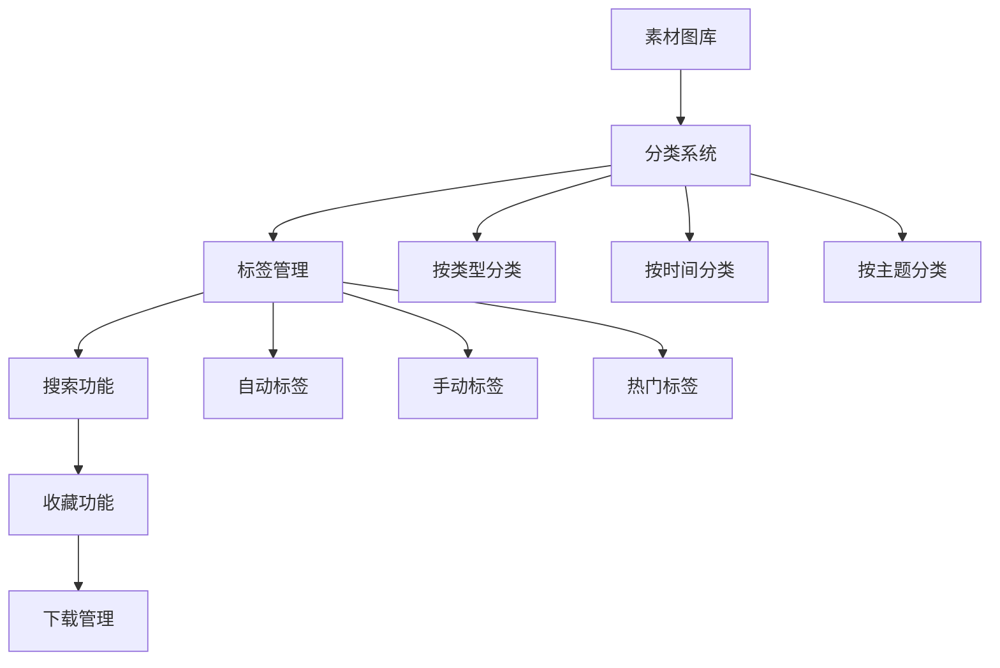
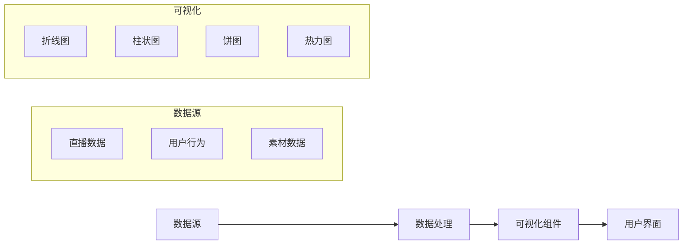

# 岁己应援站完善规划

## 当前状态分析

### 已完成功能
1. ✅ 主页基本框架（三个标签页）
2. ✅ Wiki页面（角色资料、招式展示、历程时间线）
3. ✅ 素材图库基础展示
4. ✅ 直播记录日历视图
5. ✅ 响应式设计和暗色主题

### 待完善功能
1. 🔄 素材图库分类和搜索
2. 🔄 直播记录详细查看
3. 🔄 用户交互功能
4. 🔄 数据管理后台
5. 🔄 移动端优化

## 完善方向规划

### 1. 内容管理系统增强

#### 1.1 素材图库升级


**具体功能：**
- **智能分类**: 按角色、服装、场景、表情等自动分类
- **标签系统**: 支持多标签筛选和搜索
- **收藏功能**: 用户可收藏喜欢的素材
- **批量下载**: 支持选择多张图片打包下载
- **预览优化**: 大图预览、幻灯片播放

#### 1.2 直播记录系统
- **详细记录**: 每场直播的详细信息（时长、主题、亮点）
- **时间轴视图**: 按时间轴展示直播历程
- **数据统计**: 直播时长统计、热门时段分析
- **关联素材**: 直播截图、精彩片段关联
- **评论互动**: 用户可对直播记录添加评论

### 2. 用户交互功能

#### 2.1 用户系统
```typescript
// 用户数据结构
interface User {
  id: string;
  username: string;
  avatar: string;
  joinDate: Date;
  level: number;
  points: number;
  favorites: string[]; // 收藏的素材ID
  comments: Comment[];
}

// 权限系统
enum UserRole {
  Guest = 'guest',     // 游客
  Member = 'member',   // 注册会员
  VIP = 'vip',         // VIP会员
  Admin = 'admin'      // 管理员
}
```

**功能模块：**
- **注册登录**: 邮箱/第三方登录
- **个人中心**: 个人信息、收藏、评论管理
- **等级系统**: 基于活跃度的等级制度
- **积分系统**: 完成任务获得积分
- **消息通知**: 系统通知、回复提醒

#### 2.2 社区互动
- **评论系统**: 对素材、直播记录进行评论
- **点赞功能**: 点赞喜欢的內容
- **分享功能**: 分享到社交媒体
- **话题讨论**: 创建和参与话题讨论
- **活动报名**: 线上/线下活动报名

### 3. 数据可视化

#### 3.1 统计仪表盘


**统计内容：**
- **访问统计**: PV/UV、访问来源、设备分布
- **内容热度**: 热门素材、热门直播
- **用户活跃**: 活跃时段、用户留存
- **增长趋势**: 用户增长、内容增长趋势

#### 3.2 个性化推荐
- **基于内容**: 相似素材推荐
- **基于用户**: 根据用户喜好推荐
- **热门推荐**: 近期热门内容
- **季节推荐**: 节日/季节相关推荐

### 4. 技术架构优化

#### 4.1 前端优化
- **性能优化**: 图片懒加载、代码分割
- **PWA支持**: 渐进式Web应用
- **离线缓存**: 重要内容离线访问
- **推送通知**: 新内容推送提醒

#### 4.2 后端增强
- **API优化**: RESTful API设计
- **数据库**: 考虑使用PostgreSQL或MongoDB
- **文件存储**: 云存储集成（如AWS S3、阿里云OSS）
- **搜索服务**: 全文搜索功能

### 5. 移动端体验

#### 5.1 响应式优化
- **移动优先**: 优先考虑移动端体验
- **手势支持**: 滑动、缩放等手势操作
- **离线功能**: 移动端离线缓存
- **PWA应用**: 可安装到手机桌面

#### 5.2 原生应用考虑
- **React Native**: 使用React Native开发原生应用
- **Flutter**: 考虑使用Flutter跨平台开发
- **小程序**: 微信小程序版本

## 实施路线图

### 第一阶段：基础功能完善（1-2周）
1. **素材图库升级**
   - 实现分类系统
   - 添加标签功能
   - 优化搜索体验

2. **直播记录增强**
   - 完善详细记录页面
   - 添加时间轴视图
   - 实现基础统计

### 第二阶段：用户系统建设（2-3周）
1. **用户系统开发**
   - 注册登录功能
   - 个人中心页面
   - 收藏评论功能

2. **社区功能**
   - 评论系统
   - 点赞分享
   - 基础互动

### 第三阶段：高级功能开发（3-4周）
1. **数据可视化**
   - 统计仪表盘
   - 个性化推荐
   - 数据分析

2. **移动端优化**
   - PWA支持
   - 移动端专属功能
   - 性能优化

### 第四阶段：扩展和创新（持续）
1. **新技术集成**
   - AI内容识别
   - AR/VR体验
   - 语音交互

2. **生态扩展**
   - 周边商城
   - 线下活动
   - 合作平台

## 技术实现建议

### 1. 状态管理
```typescript
// 使用Zustand或Redux Toolkit进行状态管理
import { create } from 'zustand';

interface UserStore {
  user: User | null;
  isLoggedIn: boolean;
  login: (userData: User) => void;
  logout: () => void;
  updateProfile: (updates: Partial<User>) => void;
}

const useUserStore = create<UserStore>((set) => ({
  user: null,
  isLoggedIn: false,
  login: (userData) => set({ user: userData, isLoggedIn: true }),
  logout: () => set({ user: null, isLoggedIn: false }),
  updateProfile: (updates) =>
    set((state) => ({ user: state.user ? { ...state.user, ...updates } : null })),
}));
```

### 2. API设计
```typescript
// API端点设计
const API_ENDPOINTS = {
  // 用户相关
  AUTH: {
    LOGIN: '/api/auth/login',
    REGISTER: '/api/auth/register',
    LOGOUT: '/api/auth/logout',
    PROFILE: '/api/auth/profile',
  },

  // 内容相关
  CONTENT: {
    MATERIALS: '/api/materials',
    MATERIAL_DETAIL: '/api/materials/:id',
    LIVE_RECORDS: '/api/live-records',
    COMMENTS: '/api/comments',
  },

  // 统计相关
  ANALYTICS: {
    VISITS: '/api/analytics/visits',
    POPULAR: '/api/analytics/popular',
    USER_STATS: '/api/analytics/user-stats',
  },
};
```

### 3. 数据库设计
```sql
-- 用户表
CREATE TABLE users (
  id UUID PRIMARY KEY DEFAULT gen_random_uuid(),
  username VARCHAR(50) UNIQUE NOT NULL,
  email VARCHAR(100) UNIQUE NOT NULL,
  avatar_url TEXT,
  role VARCHAR(20) DEFAULT 'member',
  created_at TIMESTAMP DEFAULT CURRENT_TIMESTAMP,
  updated_at TIMESTAMP DEFAULT CURRENT_TIMESTAMP
);

-- 素材表
CREATE TABLE materials (
  id UUID PRIMARY KEY DEFAULT gen_random_uuid(),
  title VARCHAR(200) NOT NULL,
  description TEXT,
  image_url TEXT NOT NULL,
  category VARCHAR(50),
  tags JSONB DEFAULT '[]',
  uploader_id UUID REFERENCES users(id),
  view_count INTEGER DEFAULT 0,
  like_count INTEGER DEFAULT 0,
  created_at TIMESTAMP DEFAULT CURRENT_TIMESTAMP
);

-- 直播记录表
CREATE TABLE live_records (
  id UUID PRIMARY KEY DEFAULT gen_random_uuid(),
  title VARCHAR(200) NOT NULL,
  description TEXT,
  start_time TIMESTAMP NOT NULL,
  end_time TIMESTAMP,
  duration INTEGER, -- 单位：分钟
  platform VARCHAR(50),
  viewer_count INTEGER,
  highlights JSONB DEFAULT '[]',
  created_at TIMESTAMP DEFAULT CURRENT_TIMESTAMP
);
```

## 成功指标

### 1. 用户体验指标
- **页面加载时间**: < 3秒
- **移动端兼容性**: 100%设备支持
- **用户满意度**: > 90%
- **功能使用率**: > 70%

### 2. 业务指标
- **用户增长**: 月增长 > 20%
- **用户活跃**: DAU/MAU > 30%
- **内容增长**: 月新增素材 > 100
- **社区互动**: 日均评论 > 50

### 3. 技术指标
- **性能评分**: Lighthouse评分 > 90
- **可用性**: 系统可用性 > 99.5%
- **安全性**: 无高危安全漏洞
- **可维护性**: 代码覆盖率 > 80%

## 风险与应对

### 1. 技术风险
- **性能问题**: 实施性能监控和优化
- **数据安全**: 加强安全防护和数据备份
- **兼容性问题**: 多浏览器/设备测试

### 2. 运营风险
- **内容管理**: 建立内容审核机制
- **用户管理**: 完善用户行为规范
- **版权问题**: 确保素材版权合规

### 3. 资源风险
- **开发资源**: 合理规划开发周期
- **服务器资源**: 根据流量弹性扩展
- **维护成本**: 优化架构降低维护成本

通过系统化的规划和实施，岁己应援站将成为一个功能完善、用户体验优秀、可持续发展的粉丝社区平台。
